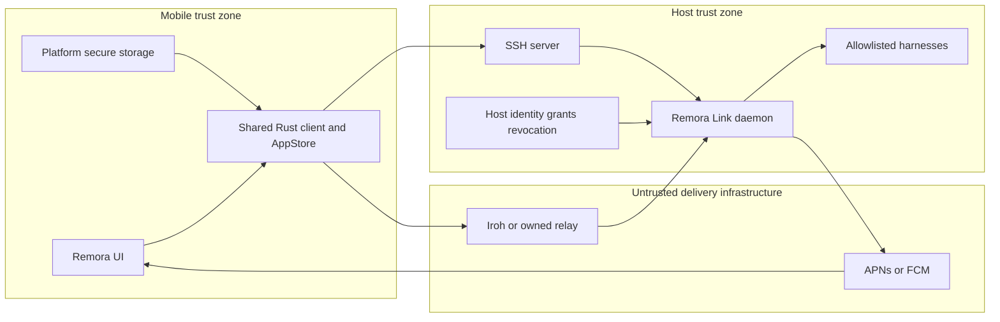

# Remora Link security threat model

- Status: design and release-gate threat model
- Date: 2026-07-15
- Scope: Remora Link pairing v2, direct and relayed Iroh transport, SSH
  transport, opaque push wakeups, multi-harness launch, device grants and
  revocation, secret storage, and remote approvals

## Executive summary

Remora has useful transport and storage foundations, but the current remote
pairing authorization model is not a safe base for Remora Link v2. The active
Alleycat path authenticates the host's Iroh endpoint and encrypts traffic, then
authorizes every operation with one host-wide bearer token copied in QR or JSON.
That token has no device binding, capability scope, expiry, or per-device
revocation. A separate, apparently dormant proximity-pairing module listens on
all interfaces over unauthenticated cleartext WebSocket and trusts a
client-reported distance. Neither path should remain as an automatic fallback
after the v2 cutover.

The required v2 security boundary is:

1. The Link host owns a long-lived host identity, is the sole grant issuer, and
   remains the authoritative source of revocation.
2. Pairing creates a device key and a host-signed, device-bound, least-privilege
   grant after explicit confirmation on the host. The invite is a short-lived,
   single-use bootstrap challenge, not a reusable bearer credential.
3. Every connection proves possession of the device private key. Every
   privileged operation is checked against the grant, revocation state, request
   freshness, harness scope, and current host policy.
4. Direct Iroh, relayed Iroh, and SSH are routes to the same authorization
   policy. A relay, push provider, transport fallback, or harness is never an
   identity or authorization authority.
5. Relay payloads remain end-to-end encrypted. Push contains only opaque wake
   hints and can cause an authenticated reconcile, never launch, approve,
   grant, revoke, or display remote content by itself.
6. Link detects and launches only operator-allowlisted installed harnesses.
   It never installs a harness, accepts an arbitrary executable, exposes a
   generic shell capability, or enables permission-bypass flags by default.

The release-blocking risks are pairing-token theft, grant forgery or
overbreadth, incomplete revocation, approval replay or cross-host confusion,
arbitrary harness launch, and transport-policy drift. The verification
properties and no-regression requirements below turn those risks into concrete
implementation gates.

## Scope and assumptions

### In scope

- iOS and Android Remora clients, the shared Rust client, and the future Link
  host daemon;
- enrollment, re-pairing, device grants, local device deletion, host-side
  revocation, expiry, and key rotation;
- Iroh direct and relay paths, SSH, and route changes during reconnect;
- APNs/FCM wake delivery and a future ciphertext-blind routing relay;
- host-side discovery and launch of multiple installed agent harnesses;
- remote command, file-change, and tool approvals;
- device, host, SSH, push, and harness secret storage;
- availability attacks against pairing, relay, push, event streams, process
  launch, and host resources;
- compromise of a relay, a stolen device, a malicious harness, a compromised
  host, and a compromised dependency.

### Confirmed design assumptions

- The relay is ciphertext-blind except for the minimum routing metadata needed
  to deliver frames.
- Push carries only an opaque device/host identifier, monotonic sequence,
  event class or collapse key, and expiry. It never carries a prompt,
  transcript, command, path, approval decision, credential, or grant.
- The Link host owns its long-lived identity and the grant/revocation
  authority. It signs scoped per-device grants and durably stores revocation.
  It may publish only a hashed or opaque deny hint to the relay.
- A device may delete its local grant but cannot restore, reissue, widen, or
  revoke another device's grant. Host confirmation is required for new
  enrollment.
- Harness launch authority stays in the local Link daemon. The daemon detects
  and launches only operator-allowlisted installed harnesses, never installs
  one, and requires an explicit grant capability for each launch.
- Hosted push and proxy infrastructure is a target design boundary, not code
  that exists in this repository today. `CONTEXT.md:19-21` explicitly excludes
  it from the current repository.

### Security reference baseline

- Iroh identifies an endpoint by a public key and encrypts QUIC traffic to that
  endpoint. The application still has to decide whether the authenticated peer
  is authorized. Iroh relays cannot read the encrypted payload, but can observe
  endpoint IDs, network addresses, timing, and traffic volume. See the
  [Iroh crate security model](https://docs.rs/iroh/latest/iroh/),
  [Iroh FAQ](https://docs.iroh.computer/about/faq), and
  [Iroh relay security and privacy guidance](https://docs.iroh.computer/deployment/security-privacy).
- QUIC 0-RTT data can be replayed; the application protocol must define what is
  safe in early data. Remora Link must not accept any state-changing request in
  0-RTT. See [RFC 9001, section 9.2](https://www.rfc-editor.org/rfc/rfc9001.html#section-9.2).
- A signed grant should use a standard signature envelope and deterministic,
  validated encoding rather than ad hoc JSON signing. Suitable building blocks
  are [COSE Sign1 in RFC 9052](https://www.rfc-editor.org/rfc/rfc9052.html),
  [deterministic CBOR in RFC 8949](https://www.rfc-editor.org/rfc/rfc8949.html),
  and [Ed25519 in RFC 8032](https://www.rfc-editor.org/rfc/rfc8032.html).
- Apple says notification payloads should not contain sensitive data, and
  background notifications are low-priority, throttled, and not guaranteed.
  See [Apple's remote-notification payload guidance](https://developer.apple.com/documentation/usernotifications/generating-a-remote-notification),
  [APNs delivery guidance](https://developer.apple.com/documentation/usernotifications/sending-notification-requests-to-apns),
  and [background update guidance](https://developer.apple.com/documentation/usernotifications/pushing-background-updates-to-your-app).
- FCM transport encryption is not end-to-end encryption. Google recommends an
  empty wake followed by an app-server fetch for sensitive data, and documents
  that collapsible messages are not ordered. See
  [FCM message encryption](https://firebase.google.com/docs/cloud-messaging/encryption),
  [collapsible messages](https://firebase.google.com/docs/cloud-messaging/customize-messages/collapsible-message-types),
  and [Android receive behavior](https://firebase.google.com/docs/cloud-messaging/android/receive-messages).
- SSH server identity must be verified. RFC 4253 warns that accepting a host key
  without verification makes the connection insecure against active attack.
  See [RFC 4253, section 8](https://www.rfc-editor.org/rfc/rfc4253.html#section-8).

### Out of scope

- Breaking the cryptographic primitives in Iroh/QUIC, Ed25519, iOS Keychain, or
  Android Keystore;
- preventing an already-compromised host administrator from reading host data,
  replacing Link, issuing new valid grants, or approving operations locally;
- preventing an already-compromised mobile OS from observing data while Remora
  is running;
- anonymity against the relay, push provider, or network observer;
- app-store release infrastructure and hosted service implementation details
  that are not yet present in this repository.

Host and mobile compromise are nevertheless modeled below so the design makes
the blast radius and recovery story explicit.

## Current implementation evidence

This table distinguishes controls that exist now from v2 requirements. A future
design statement is not counted as an implemented mitigation.

| Surface | Repository evidence | Security consequence |
| --- | --- | --- |
| Active remote pairing | `shared/rust-bridge/codex-mobile-client/src/alleycat.rs:22-33` fixes protocol v1 and ALPN `alleycat/1`; the parsed payload contains a raw `token`. `alleycat.rs:301-320` sends it on list, restart, and connect. | Iroh authenticates/encrypts the peer route, but authorization is one reusable host-wide bearer secret with no scope, subject key, expiry, or per-device revoke. |
| Pairing input | iOS accepts QR or clipboard JSON and shows a token-bearing example at `apps/ios/Sources/Remora/Views/RemotePairingSheet.swift:129-221`; Android does the same at `apps/android/app/src/main/java/com/remora/android/ui/discovery/RemotePairingSheet.kt:313-325`. | QR images, clipboard history, screen capture, logs, or a malicious app with clipboard access can disclose full host authority. |
| Host implementation | The pinned Alleycat host compares one global token before list/restart/connect in [`host.rs`](https://github.com/amanthanvi/alleycat/blob/3c6dfe2c6b060864d8cb0fcae58f73a6ed1ea10f/crates/alleycat/src/host.rs#L123-L225); its pair payload contains that token in [`host.rs`](https://github.com/amanthanvi/alleycat/blob/3c6dfe2c6b060864d8cb0fcae58f73a6ed1ea10f/crates/alleycat/src/host.rs#L238-L249). | Rotating the global token invalidates all future clients, but there is no device-scoped grant or selective revocation. Existing streams are not a durable revocation boundary. |
| Iroh path | `alleycat.rs:633-692` binds a persisted endpoint key and connects to a known endpoint ID over the selected ALPN; `alleycat.rs:695-744` bounds JSON frames to 1 MiB. | The transport has peer authentication, encryption, and a useful frame bound. The stable app-wide device endpoint can also correlate the same mobile device across hosts. |
| Dormant proximity pairing | `shared/rust-bridge/codex-mobile-client/src/pair/mod.rs:283-343` binds `0.0.0.0`, publishes Bonjour data, and accepts WebSocket clients. `pair/mod.rs:236-265` returns a `ws://` URL after a hello; `pair/mod.rs:45-71` trusts client-supplied distance. No handwritten Swift/Kotlin caller was found. | This FFI-reachable path is not suitable as a v2 fallback: it lacks channel encryption, peer authentication, replay protection, rate limits, and cryptographic proximity proof. Its text frames and event queue are unbounded. |
| iOS secret storage | `apps/ios/Sources/Remora/Models/AlleycatCredentialStore.swift:50-149` stores the token as `WhenUnlockedThisDeviceOnly` and the Iroh key as `AfterFirstUnlockThisDeviceOnly`. | At-rest protection and non-migrating accessibility classes are good foundations. Token persistence failure is logged but pairing still succeeds at `RemotePairingSheet.swift:449-473`, creating a false-success/recovery inconsistency. |
| Android secret storage | `apps/android/app/src/main/java/com/remora/android/state/EncryptedPrefs.kt:31-40` uses encrypted preferences; `AlleycatCredentialStore.kt:6-44` stores token and raw endpoint key. `AndroidManifest.xml:13-20` enables backup and cleartext traffic. | Secrets are encrypted at rest, but the current raw key is exportable in process memory. Encrypted preferences must be excluded from backup; the [Android API documentation](https://developer.android.com/reference/androidx/security/crypto/EncryptedSharedPreferences) explicitly requires that and marks the API deprecated. Opening failure currently deletes and recreates the preference file (`EncryptedPrefs.kt:21-29`), which can silently destroy grants and revocation-adjacent state. |
| Terminal snapshot boundary | `shared/rust-bridge/codex-mobile-client/src/terminal/session.rs:19-36` puts the Alleycat token or full SSH auth inside `TerminalBackendKind`. `store/snapshot.rs:332-349` embeds that backend in `TerminalSessionSnapshot`, and `store/boundary.rs:452-464,532-543` projects terminal snapshots over UniFFI. | Credentials that should remain behind an opaque transport reference currently cross the broad observable-state boundary and can reach platform memory, debugging, equality dumps, or future serialization. |
| SSH trust | `shared/rust-bridge/codex-mobile-client/src/terminal/ssh_known_hosts.rs:1-88` stores SHA-256 host pins; `terminal/ssh/connect.rs:30-141` checks the presented key and fails when policy rejects it. | This is the correct trust primitive. Link must not introduce an automatic trust-on-first-use or cleartext fallback, and SSH must not bypass Link grant policy. |
| Remote approvals | `types/server_requests.rs:225-272` knows `server_id`, thread, turn, item, command/path, and grant root. Yet `mobile_client/user_input.rs:300-343`, `mobile_client/event_loop.rs:401-409`, and `store/reducer.rs:1078-1089,1890-1909` resolve or de-duplicate approvals by `request_id` alone. | Identical request IDs from different hosts or harnesses can collide, suppress, or resolve the wrong pending approval. The response is not bound to a connection epoch, harness, challenge nonce, or expiry. |
| Reconnect retry | `shared/rust-bridge/codex-mobile-client/src/session/connection.rs:1616-1649` clones any JSON-RPC request and retries it after a transport failure. | If the first mutating request reached the host but its reply was lost, reconnect can execute the mutation twice. There is no local read/mutation classification or receipt requirement at this layer. |
| Remote file content | `ffi/client/remote_content.rs:139-190,301-324` reads a caller-supplied remote path by launching a one-off shell/PowerShell command, with a 20 MB command-output cap but no thread-root confinement in that helper. | Exposing this helper as a Link file-preview primitive would turn a read grant into arbitrary host-file disclosure and shell-dependent policy. A new root-bound typed API is required instead. |
| Harness policy | The pinned Alleycat host rejects unknown/disabled agent names, but current defaults include broad harness options such as Claude permission bypass and Amp allow-all in [`config.rs`](https://github.com/amanthanvi/alleycat/blob/3c6dfe2c6b060864d8cb0fcae58f73a6ed1ea10f/crates/alleycat/src/config.rs#L107-L168), plus an enabled shell harness in [`config.rs`](https://github.com/amanthanvi/alleycat/blob/3c6dfe2c6b060864d8cb0fcae58f73a6ed1ea10f/crates/alleycat/src/config.rs#L263-L288). | Name allowlisting is useful but insufficient. Link v2 must not inherit permissive defaults, a generic shell, arbitrary path/arguments/environment, or remote install authority. |
| Dependency and protocol source | `shared/rust-bridge/Cargo.toml:28-31` pins all four Alleycat crates to commit `3c6dfe…` in Aman's fork. Normal build/check/test lanes consume the pin unchanged (`Makefile:356-378`). Updating is the explicit `make update-remora-link REV=<40-sha>` flow; `tools/scripts/update-remora-link.sh:10-59` validates the revision, refuses dirty Cargo inputs, updates exact packages, and restores manifest/lock on failure. Remora's remote-host wire remains handwritten in `alleycat.rs`, not type-shared with those crates. | Build-time branch drift is mitigated. Residual risk is a reviewed-but-incompatible or compromised pin/host update, plus security semantic drift between the separately implemented host protocol and Remora client adapter. |

The current Iroh transport is therefore not "insecure transport." The central
gap is that transport authentication is followed by bearer-token authorization
rather than device-bound, scoped authorization.

## System model

### Components

| Component | Security responsibility |
| --- | --- |
| Remora iOS/Android UI | Obtain local user intent, display verified host/harness/action context, request platform permissions, and avoid exposing protocol secrets. |
| Shared Rust mobile client and `AppStore` | Parse opaque ingress, verify host/grants, enforce replay and state-machine rules, reconcile authoritative state, and expose typed display-safe projections. |
| Platform secure-storage adapters | Protect device keys, grant blobs, SSH credentials, host pins, push tokens, and crash-safe commit markers. |
| Remora Link daemon | Own host identity, issue grants, enforce revocation and capabilities, select routes, launch allowlisted harnesses, authenticate requests, and audit security events. |
| Host identity/grant store | Persist the host signing key, grant records, policy epoch, revocation tombstones, and operator configuration. |
| Harness processes | Execute Codex or other explicitly installed runtimes. They are less trusted than Link and must not define authorization policy. |
| Iroh direct path and relay | Deliver encrypted QUIC traffic. Endpoint identity is cryptographic; route and relay location are not authorization. |
| SSH server/client | Provide an alternate encrypted, server-pinned transport and user authentication. |
| Routing relay | Route ciphertext using opaque identifiers; observe minimal metadata; drop, delay, replay, duplicate, or reorder traffic without gaining Link authority. |
| APNs/FCM | Deliver best-effort opaque wake hints; may drop, delay, duplicate, reorder, throttle, or expose payloads to provider infrastructure. |

### Trust boundaries

| ID | Boundary | Required security property |
| --- | --- | --- |
| TB-01 | Platform UI/storage adapter ↔ shared Rust | Secrets stay behind an opaque typed seam; native code does not recreate grant, replay, or reconciliation policy. |
| TB-02 | Mobile device ↔ Link over direct/relayed Iroh | Mutual cryptographic identity, device proof-of-possession, signed grant authorization, freshness, bounded frames, and no route-based trust. |
| TB-03 | Mobile device ↔ SSH server | Pinned host key, authenticated user, encrypted channel, and the same Link authorization policy after transport establishment. |
| TB-04 | Link/mobile ↔ relay and discovery | End-to-end ciphertext; route records are hints; metadata minimized and rate-limited; no identity downgrade. |
| TB-05 | Link/relay ↔ APNs/FCM ↔ mobile OS | Opaque, expiring, collapsible wake hints only; authenticated reconciliation before any content or action. |
| TB-06 | Link daemon ↔ harness | Explicit allowlist, trusted executable resolution, constrained environment/cwd/resources, typed protocol, and policy enforcement outside the harness. |
| TB-07 | Local host operator ↔ Link identity/grant store | Local OS authorization, durable atomic writes, explicit enrollment/revocation, and secret-free audit. |
| TB-08 | Harness event ↔ pending approval ↔ mobile response | Exact host, grant, session, harness, request, challenge, action, and expiry binding; one-time decision. |



### Security-relevant data flows

1. **Pairing:** the host creates a short-lived one-time offer containing the
   pinned host identity, protocol/version, rendezvous hints, challenge ID, and
   expiry. The device generates or selects a per-host device key, connects to
   the pinned host, binds the offer and both identities to the handshake, and
   asks to enroll. The host shows the device identity and requested capabilities
   locally. Only local confirmation consumes the challenge and issues a signed
   grant.
2. **Normal connection:** the device authenticates the pinned host, presents the
   signed grant, and proves possession of the grant's subject key. Link checks
   expiry, policy epoch, revocation, requested capability, harness scope, and
   request freshness before admission and again at each privileged operation.
3. **Relayed connection:** the same encrypted authenticated session crosses a
   relay. A direct/relay path change does not change identities or privileges.
4. **Push wake:** Link or its routing service sends an opaque host/device ID,
   event class, monotonic sequence, expiry, and collapse key. Remora validates
   shape/expiry, coalesces the hint, then performs authenticated reconciliation.
5. **Harness launch:** Link maps a typed harness ID to a locally configured,
   operator-approved absolute executable and fixed launch policy. It verifies a
   `launch:<harness>` capability, starts within quotas, and associates the
   process with host, device, grant, and session audit context.
6. **Remote approval:** a harness emits a typed approval challenge. Link binds
   it to the connection epoch and session, and Remora renders verified host,
   harness, cwd, command/path, scope, and expiry. A signed/authenticated decision
   resolves that exact challenge once.
7. **Revocation:** the host durably records a tombstone or increments a policy
   epoch, rejects subsequent requests, and terminates active sessions. Relay
   deny hints and push may accelerate convergence but cannot weaken host state.

## Assets

| Asset | Why it matters | Required protection |
| --- | --- | --- |
| Host identity/signing key | Can authenticate the host and issue every device grant. | Host-only, non-exportable where practical, backup/recovery controlled, rotation supported, never logged or sent to relay. |
| Device private key | Proves the subject of a grant. | Per-host or privacy-preserving derivation, non-exportable where practical, device-only storage, use authorization appropriate to background vs interactive actions. |
| Signed device grant | Defines remote authority. | Integrity, audience/subject binding, least privilege, expiry, policy version, revocation check, no bearer-only use. |
| Revocation registry and policy epoch | Ends device authority. | Durable, atomic, fail-closed, checked on restart and active operations, authoritative only on host. |
| Pairing challenges and transcripts | Bootstrap trust. | Short-lived, single-use, channel- and identity-bound, race-safe, excluded from clipboard/logs after use. |
| Sessions, prompts, transcripts, code, paths, files, and images | Confidential user and repository data. | End-to-end encryption, typed bounded parsing, least disclosure, no push payloads, retention controls. |
| Approval challenges and decisions | Can authorize command execution or file changes. | Exact-context binding, clear display, one-time use, expiry, replay/collision resistance, audit. |
| Harness/provider credentials and environment | Can grant access to source, cloud accounts, and model providers. | Do not inherit broadly; redact logs; isolate harness; never expose to mobile/relay unless required and scoped. |
| SSH password, private key, passphrase, and host pin | Authenticate user and server. | Device-only secure storage, server-pin verification, no command-line/log exposure, explicit rotation. |
| Push registration tokens and routing metadata | Permit wake delivery and correlation. | Treat as credentials, minimize retention/linkability, rotate/delete on revoke, rate-limit use. |
| Transport credentials hidden behind terminal handles | Authenticate Alleycat/SSH terminal backends. | Never project token/auth values into `AppStore`, UniFFI snapshots, logs, analytics, or UI; use opaque non-secret transport references. |
| Audit trail | Supports incident detection and revocation investigation. | Secret-free, integrity-protected, bounded retention, reliable timestamps/correlation IDs. |
| Host compute, device battery, relay quota, and harness slots | Availability and cost. | Authentication before expensive work, backpressure, quotas, timeouts, collapse, and rate limits. |
| Dependency lock, protocol fixtures, and release artifact | Determine code with host process authority and whether host/client security semantics agree. | Reviewed immutable revisions, provenance, reproducible CI input, compatibility fixtures against the exact host artifact, and no implicit dependency refresh. |

## Attacker model

### Capabilities considered

- A LAN or internet attacker can scan, connect, flood, drop, delay, replay,
  duplicate, reorder, or race traffic and can steal a copied/photographed
  pairing payload.
- A relay operator or compromised relay can observe routing metadata and traffic
  shape, choose routes, wake-bomb devices, and manipulate ciphertext delivery.
- A push provider, compromised push credential, or malicious service worker can
  send, drop, delay, duplicate, reorder, or inspect push payloads.
- A thief can possess a locked or unlocked paired phone; an installed malicious
  mobile app can seek clipboard, backup, notification, log, or IPC leakage.
- A paired but malicious device has its own valid key/grant and can exercise,
  race, replay, or probe every capability in that grant.
- A malicious or compromised harness can emit deceptive output and approval
  prompts, consume host resources, exploit its inherited environment, or try to
  confuse Link's session/request mapping.
- A host compromise can read user data, replace Link/harnesses, issue grants,
  change revocation, and impersonate the host. The model can reduce persistence
  and improve detection, but cannot preserve host confidentiality after this.
- A dependency or build-path compromise can alter code that authenticates
  devices or launches processes.

### Capabilities not granted by assumption

- The attacker cannot break standard cryptography or derive private keys from a
  public Iroh endpoint ID.
- A relay cannot decrypt valid Link ciphertext or mint a host signature.
- A push message is not accepted as proof of host identity or authorization.
- A revoked device cannot sign as the host or cause the host to reissue a grant
  without a new, locally confirmed enrollment.
- A remote device cannot choose or install an arbitrary harness under the
  intended Link policy.

## Entry points

| Entry point | Attacker-controlled input | Primary validation and limits |
| --- | --- | --- |
| QR, universal link, clipboard, share sheet, camera | Encoded invite bytes, URLs, Unicode, nested data | Global byte/depth limits before decode; exact schema/version; expiry; pinned host identity; one-time challenge; no secret fields exposed to platform snapshots. |
| Iroh connection and streams | Endpoint, ALPN, frames, ordering, reconnect/resume state | Exact v2 negotiation; pinned host/device IDs; grant proof; no silent downgrade; 1 MiB or tighter per-message bounds; concurrency/rate limits; no mutation in 0-RTT. |
| Relay/discovery records | Route, endpoint hint, opaque IDs, relay URL | Treat as untrusted hints; allowlisted schemes; identity pin survives route changes; SSRF/private-address policy where HTTP control planes exist. |
| Push receiver | Device/host ID, event class, sequence, expiry, collapse key | Exact allowlist schema and maximum size; no content/actions; expiry and sequence checks; rate/collapse; authenticated reconcile only. |
| SSH address/auth/trust prompt | Host, port, username, key/password, host key, forwarding target | Strict parsing; pinned server key; device-only secret store; no automatic changed-key acceptance; same grant policy beyond tunnel. |
| Device-grant verifier | Signed bytes, claims, key proof, policy version | Canonical COSE/CBOR validation; algorithm fixed; issuer/audience/subject/scope/time/epoch; revocation; proof-of-possession; reject unknown critical fields. |
| Revocation API/UI | Grant/device ID, reason, policy epoch | Local host authorization; durable write before success; idempotency; active-session termination; audit. |
| Harness discovery/launch | Harness ID, executable metadata, cwd, args, env, session count | Typed ID only; operator allowlist; trusted absolute file; ownership/mode/symlink checks; fixed args/env policy; no install/shell; quotas. |
| Harness protocol/event stream | JSON/JSONL/WebSocket messages, tool calls, output, file paths, request IDs | Bounded typed parser; per-session namespace; backpressure; output treated untrusted; challenge/context binding; protocol-version pin. |
| Remote workspace/file read | Server/thread/workspace identity, relative path, symlinks, binary/large content | Dedicated read-only capability; bind to exact thread root; reject absolute/traversal/NUL; realpath root and target; reject symlink escape, non-file, disallowed binary, and oversize content; no one-off shell fallback. |
| Approval response | Decision, request/challenge ID, session grant | Exact pending challenge; host/session/harness/epoch/nonce binding; expiry; one-time atomic consume; authorization for requested scope. |
| Secure-storage adapter and migration | Corrupt/missing/rolled-back records, backup restore, old schema | Authenticated/versioned records; atomic commit; fail closed; backup exclusion; no false pairing success; explicit recovery/repair state. |

## Top abuse paths

### AP-01 — Stolen v1 pairing JSON becomes full host authority

1. The attacker obtains a QR screenshot, clipboard record, terminal scrollback,
   or JSON containing the current host-wide token.
2. The attacker connects to the public Iroh endpoint from a new device.
3. The host accepts list/restart/connect because the token is the only
   application authorization.
4. The attacker launches an enabled harness and accesses sessions until the
   global token is rotated.

**Break the path:** v2 invites contain no reusable authorization; enrollment is
single-use and host-confirmed; the issued grant is bound to a device public key,
scoped, expiring, and selectively revocable. Disable v1 after an explicit
cutover and never silently retry it.

### AP-02 — Pairing race enrolls an attacker's key

1. An attacker copies a valid but unused invite or observes a proximity
   advertisement.
2. The attacker reaches Link before the intended device and submits their own
   device public key.
3. A weak implementation consumes the invite on network arrival or shows only a
   generic "pair?" dialog.
4. The attacker's device receives a valid grant.

**Break the path:** bind host identity, device key, offer nonce, capabilities,
and handshake transcript; show the device identity and requested capabilities
on the host; consume the nonce atomically only after local confirmation; reject
parallel/replayed attempts. Proximity/distance is an affordance, never proof.

### AP-03 — Stolen or revoked device keeps an active session

1. A thief uses a previously paired device or copies an exportable key from a
   compromised device.
2. The owner revokes the grant, but Link checks revocation only during new
   connection setup or trusts stale relay deny state.
3. The existing stream continues to approve actions or launch harnesses.

**Break the path:** commit revocation locally before reporting success; check
grant ID/device key and policy epoch at admission and every privileged action;
close all sessions for the grant; preserve tombstones across restart; treat
relay state as an acceleration hint only. Use short grant/session lifetimes as
defense in depth, not as the revocation mechanism.

### AP-04 — Approval ID collision or replay authorizes the wrong action

1. Two hosts/harnesses produce the same request ID, or a malicious harness
   deliberately reuses one.
2. The current reducer de-duplicates by request ID alone.
3. A response to the benign request resolves or suppresses the malicious one,
   or a captured response is replayed after reconnect.

**Break the path:** derive one opaque approval key from host ID, grant ID,
connection epoch, harness ID, session/thread/turn/item, request ID, challenge
nonce, action digest, and expiry. Display the verified context. Atomically
consume exactly one pending challenge; never accept approval responses in
0-RTT or from push.

### AP-05 — Broad launch input becomes arbitrary host code execution

1. A device with a generic launch capability submits a harness name, path,
   arguments, environment, cwd, or shell fragment.
2. PATH/symlink manipulation or a permissive harness default selects attacker
   code or enables `--dangerously-*` behavior.
3. Link launches it with the user's inherited secrets and filesystem access.

**Break the path:** grants name explicit harness capabilities; Link maps typed
IDs to operator-approved absolute executables and fixed launch templates; it
checks owner/mode/symlink/integrity, uses a minimal environment and constrained
cwd, disables generic shell/install and permission-bypass defaults, and applies
process/session quotas. Authorization stays outside the harness.

### AP-06 — Malicious harness fabricates a trustworthy-looking approval

1. A compromised harness emits an approval with a misleading command preview,
   reused ID, or path that differs from the eventual operation.
2. Mobile renders the harness's label as if Link verified it.
3. The user approves; the harness swaps the operation or uses the decision in a
   different session.

**Break the path:** Link canonicalizes and hashes the exact operation, assigns
the challenge, labels untrusted fields, and binds the response to that digest.
Where the harness cannot commit to exact semantics, the UI must say so and the
grant must not imply broader authority. Sandbox/separate OS identity limits the
harness's access to host credentials and files.

### AP-07 — Relay or push compromise drives actions or drains resources

1. The attacker controlling relay/push floods wake hints, reorders frames, or
   replays an old "approval pending" class.
2. A weak client treats the hint as state, renders stale content, auto-launches,
   or repeatedly reconnects.
3. The device battery and relay/host quotas are exhausted, or the user acts on
   stale context.

**Break the path:** push is a bounded opaque hint, not state; expiry, collapse,
per-device rate limits, backoff, and a monotonic sequence limit work. Gaps,
duplicates, and reorder trigger at most one authenticated reconcile. Only the
E2E Link channel can deliver actionable content.

### AP-08 — Transport fallback bypasses stronger authorization

1. An attacker blocks direct Iroh or v2 negotiation.
2. The client falls back to `alleycat/1`, dormant cleartext `ws://` pairing, an
   unpinned SSH key, or a relay-authenticated session.
3. The attacker steals authority or gets broader capabilities on the weaker
   route.

**Break the path:** fail closed on v2 negotiation; use a distinct v2 ALPN and
no automatic protocol downgrade; pin identities across route changes; require
the same grant verifier and operation policy over Iroh and SSH; disable
cleartext Link traffic in production.

### AP-09 — Secure-store failure creates a ghost grant

1. Network pairing and harness attachment succeed, but Keychain/Keystore commit
   fails or encrypted preferences are reset.
2. The UI reports success while the device cannot prove or revoke its local
   state after restart.
3. The host still has an active grant the user cannot see locally.

**Break the path:** use a crash-safe enrollment journal; persist the key/grant
before final success or explicitly roll back/revoke the tentative host grant;
surface `NeedsRepair` rather than success; keep host-side device management as
the authoritative recovery path.

### AP-10 — Pinned host/client protocol sources drift after an update

1. An explicit pin update changes bridge/harness behavior or the separately
   deployed host daemon changes its remote-host protocol.
2. The dependency build succeeds, but Remora's handwritten `alleycat.rs` wire is
   not type-shared with the host implementation.
3. Host and client interpret authentication, scope, replay, revocation, or
   fallback fields differently, or a compromised reviewed revision alters
   process-launch policy.
4. A normal compatibility path becomes an authorization bypass, unsafe
   downgrade, or production denial after rollout.

**Break the path:** retain the exact revision pin and explicit update command;
review manifest/lock and host source together; require provenance for the host
artifact; run captured protocol/security fixtures against that exact artifact;
fail closed on unknown fields/versions; and stage host/client migration without
silent fallback.

## Threat register

| ID | Threat | Affected assets | Preconditions | Impact | Existing controls | Required mitigation | Priority |
| --- | --- | --- | --- | --- | --- | --- | --- |
| TM-001 | Reusable pairing credential theft or pairing MITM | Host sessions, files, harness access | Attacker obtains v1 JSON/QR/clipboard or races weak pairing | Unauthorized remote host access | Iroh pins/encrypts host endpoint; v1 payload parser validates shape | Non-bearer one-time offer, transcript binding, local host confirmation, device proof key, signed scoped grant, hard v1 cutover | critical |
| TM-002 | Forged, widened, misbound, or confused-deputy device grant | All remotely authorized operations | Verifier/encoding/key-management defect or grant copied to another device/host | Full remote control within forged scope | None in current bearer model | COSE Sign1 with fixed algorithm; deterministic validated claims; issuer/audience/subject/capability/time/epoch binding; proof-of-possession; negative/fuzz tests | critical |
| TM-003 | Revoked or stolen device remains authorized | Host data, approvals, compute | Existing connection, stale cache, offline relay, incomplete persistence | Continued unauthorized control after revoke | Global token rotation can block future v1 connections | Host-authoritative durable tombstone; per-op checks; active close; expiry/epoch; relay deny hint never authoritative; recovery audit | high |
| TM-004 | Approval replay, collision, substitution, or stale acceptance | Commands, file changes, credentials | Duplicate request ID, reconnect, malicious harness, captured response | Wrong or repeated high-impact action approved | UI displays some command/path context | Composite opaque key, canonical action digest, challenge nonce, connection epoch, expiry, exact one-time atomic resolution, no 0-RTT/push approvals | critical |
| TM-005 | Arbitrary executable/shell launch or permissive harness policy | Host account, source, credentials | Broad launch grant, attacker-controlled path/args/env/cwd, unsafe default | Host code execution and persistence | Current host knows a finite agent registry | Explicit per-harness capability; operator allowlist; trusted absolute binary; fixed args/env; no install/shell; bypass flags off; quotas/sandbox | critical |
| TM-006 | Malicious harness deceives user or exfiltrates host secrets | Approvals, provider keys, filesystem | Installed harness compromised or intentionally hostile | Data theft, deceptive action, lateral movement | Process separation only | Treat harness output as untrusted; Link-owned challenge/digest; minimal environment; filesystem/OS isolation; resource limits; source labels and audit | high |
| TM-007 | Relay compromise, metadata correlation, route downgrade, or wake-bombing | Confidentiality metadata, availability | Relay/operator compromise | Correlation, denial, battery/cost drain; control if route is trusted | Iroh E2E encryption and endpoint IDs | Opaque minimal IDs/retention; same auth on direct/relay; route not identity; quotas/backoff; relay deny only hint; no plaintext | medium |
| TM-008 | Push spoof/reorder/drop/duplicate causes unsafe state or resource drain | Approval freshness, battery, privacy | Push token/service compromise or normal best-effort behavior | Stale UI, denial, metadata disclosure; control if push treated as authority | No push implementation today | Opaque schema; no content/action; expiry/sequence/collapse; rate limits; authenticated full reconcile; secret push-token handling | high |
| TM-009 | Device key, grant, SSH secret, or push token extraction/backup leakage | Device/host identity and credentials | Device malware, backup restore, exportable key, logging/crash dump | Impersonation and account compromise | iOS device-only Keychain classes; Android encrypted preferences | Non-exportable Keychain/Keystore keys; split background/interactive keys; backup exclusion; no logs; atomic persistence; wipe local records on forget | high |
| TM-010 | SSH MITM, cleartext downgrade, or transport-specific broader privileges | Sessions, credentials, host actions | Unknown/changed host key accepted or fallback to `ws://`/HTTP | Credential theft and unauthorized host control | Shared SHA-256 host pin validation | Fail closed on changed/unknown key except explicit verified enrollment; prohibit cleartext Link; identical grants/policy over SSH/Iroh; pin survives route | high |
| TM-011 | Pinned dependency compromise, host/client protocol drift, or harness binary substitution | Link verifier, protocol, and launcher integrity | Compromised/review-defective explicit update, separately deployed host change, or host filesystem compromise | Grant/replay/scope mismatch, authorization bypass, denial, or host code execution | All four crates use one exact fork revision; normal lanes do not advance it; explicit update validates the SHA and restores Cargo inputs on failure | Joint host/client security review; exact-artifact protocol fixtures; staged compatibility gate; artifact provenance; binary ownership/mode/integrity checks; no silent version fallback | high |
| TM-012 | Frame, connection, event, process, or transcript exhaustion | Host/device/relay availability | Any reachable or paired attacker floods work | Crash, battery/cost drain, starvation | Alleycat frames capped at 1 MiB | Pre-auth connection limits; bounded queues; per-grant/session quotas; backpressure; launch limits; timeouts; bounded transcript retention | medium |
| TM-013 | Stable device endpoint enables cross-host correlation | Device privacy | Two hosts/relay logs compare one app-wide EndpointId | Linkage of user/device activity | Stable endpoint supports reconnect | Prefer per-host device keys/endpoint identities or a privacy-preserving binding; disclose residual relay metadata; rotate on unpair | medium |
| TM-014 | Revocation or secure-state rollback after crash/restore | Grant integrity and incident response | Corrupt storage, backup restore, clock rollback, concurrent enroll/revoke | Reanimated grant or false UI state | Platform encrypted stores | Monotonic host policy epoch, authenticated versioned records, atomic fsync/replace, tombstone-first revoke, deterministic recovery matrix | high |
| TM-015 | Terminal snapshots leak bearer token or SSH authentication material | Pairing token, SSH password/key/passphrase | Broad snapshot observation, logging/debugging, platform compromise, future serialization | Credential disclosure and host impersonation | Secure at-rest stores protect the original record | Replace credential-bearing backend enum in snapshots with opaque transport reference and non-secret descriptor; repository tests prohibit credential fields across UniFFI/state/log boundaries | critical |
| TM-016 | Ambiguous mutating RPC is automatically retried after reconnect | Commands, thread state, approvals, launches | Request reached host but response was lost | Duplicate command, approval, launch, or state transition | Remote worker reconnects automatically | Retry allowlist only for proven reads; host idempotency key plus transactional receipt for mutations; otherwise return typed `OutcomeUnknown` and reconcile before retry | high |
| TM-017 | File preview/read escapes the bound thread workspace | Source and host filesystem secrets | Paired device obtains read capability and supplies absolute/traversal/symlink path | Arbitrary host-file disclosure | Current helper bounds output/time only | New typed root-bound read API; realpath containment; no absolute/traversal/symlink escape, shell fallback, binary, or oversize; bind server/thread/workspace identity | high |

## Required security architecture

### 1. Pairing and host identity

- Use a new v2 protocol/ALPN or an equally explicit authenticated version
  negotiation. Never downgrade automatically to `alleycat/1` or the cleartext
  proximity WebSocket.
- The offer carries only public/rendezvous material: protocol version, host
  identity/public key, route hints, random one-time challenge ID, expiry, and
  requested-product context. It is safe if photographed except for metadata and
  a bounded enrollment attempt.
- Generate at least 128 bits of challenge entropy, expire quickly, cap attempts,
  and consume atomically only after host confirmation and grant commit.
- Bind the host identity, device public key, offer challenge, transcript hash,
  requested capabilities, and protocol/ALPN into confirmation and issuance.
  If a short authentication string is displayed, derive it from this transcript
  and show it on both endpoints.
- The host confirmation names the device and requested capabilities. A generic
  "Allow pairing?" dialog is insufficient when grants can launch or approve.
- Proximity, Bonjour, relay, IP address, route, host display name, and push
  identity are discovery hints, not proof.

### 2. Device keys and grants

The grant must be a signed capability object, not a secret. A minimum claim set
is:

```text
schema_version
grant_id
issuer_host_identity
audience_product_and_host
subject_device_public_key
issued_at / not_before / expires_at
policy_epoch
capabilities[]
harness_ids[]
constraints { session_limit, approval_modes, terminal_access, ... }
```

- Sign a domain-separated deterministic representation, for example COSE Sign1
  over deterministic CBOR with Ed25519. Pin the allowed algorithm; reject
  duplicate map keys, non-canonical/ambiguous claims, unknown critical fields,
  invalid time ranges, duplicate capabilities, and oversized values.
- If the Link signing key and Iroh transport identity are distinct, bind them
  with a host-identity certificate or signed transport-key record. Route
  rotation must not silently rotate the pinned host authority.
- Require a fresh challenge signature or equivalent proof-of-possession from
  the grant's subject key at connection admission. A copied grant blob alone
  must be useless.
- Make capabilities typed and closed. Example distinctions are host metadata
  read, session attach, terminal access, `launch:codex`, `launch:claude`,
  approval read, and approval decide. Do not use a single `control` bit.
- A device cannot widen or delegate its grant. Delegation, if ever needed,
  requires a separately designed host-authorized flow.

### 3. Revocation and lifecycle

- Link durably records revocation by grant ID and subject key before returning
  success. Keep a monotonically increasing policy epoch and tombstones long
  enough to cover all grant lifetimes and restore windows.
- Check signature, expiry, epoch, and revocation at connection admission and at
  every launch, terminal attach, approval decision, credential-sensitive
  operation, and session resume.
- Revocation closes active connections/process attachments and invalidates
  outstanding approval challenges for the grant. It must survive Link restart.
- A relay-side opaque deny record is only an early drop optimization. Missing,
  stale, rolled-back, or malicious relay state cannot permit an operation that
  local Link rejects.
- "Forget this host" deletes local grant/key/routing/push data, but must be
  labeled as local deletion. It does not claim host revocation. Provide a
  distinct host-authoritative revoke flow and recovery guidance for a lost
  device.

### 4. Relay, push, and replay

- Relay sees ciphertext plus the minimum opaque source/destination/routing
  identifiers, timestamps, sizes, and connection metadata. Set documented
  retention, access control, rate limits, and identifier rotation.
- Direct and relay routes use the same E2E session and pinned identities. Relay
  TLS alone is not sufficient; relay-issued identities are not trusted.
- Disable state-changing early data. Bind each mutating request to host, device,
  grant, connection/session epoch, operation type, and a unique nonce or
  monotonic sequence. Make retries idempotent with bounded result retention.
- Push schema is an allowlist: opaque destination/device ID, opaque host ID,
  monotonic sequence, event class/collapse key, and expiry. Reject any command,
  path, prompt, transcript, approval, grant, credential, or arbitrary display
  text field.
- A push duplicate/reorder/gap performs at most a coalesced authenticated sync.
  It never directly changes canonical state or prompts a high-impact decision.

### 5. Harness launch and containment

- Link discovers locally installed harnesses, but only an operator-owned
  allowlist makes one launchable. Discovery results alone never grant authority.
- Map a closed typed harness ID to an absolute executable and fixed protocol.
  Verify symlink resolution, owner, writable-mode policy, expected version, and
  optionally an artifact hash/signature before launch.
- Never accept an arbitrary binary, shell fragment, interpreter expression,
  installer request, unrestricted argv/environment, or remote PATH selection.
- Default all permission-bypass/allow-all flags off. If an operator explicitly
  enables a dangerous mode, make it a separate visibly named host policy and
  grant capability with audit and expiry; do not infer it from normal launch.
- Launch with a minimal environment, constrained cwd, bounded stdout/stderr and
  protocol frames, per-device/session/process quotas, timeouts, backpressure,
  and child cleanup.
- Treat a harness as a potentially malicious local principal. Keep device grant
  verification, approval challenge creation/consumption, revocation, and audit
  in Link. Prefer sandboxing, a separate OS account/container, or platform
  controls for high-risk harnesses.

### 6. Remote approvals

- Replace request-ID-only identity with an opaque Link-issued approval key bound
  to host identity, grant, connection epoch, harness, session/thread/turn/item,
  harness request ID, random challenge, canonical operation digest, and expiry.
- Link, not the harness, owns the canonical operation preview and digest. The
  mobile UI displays the verified host, harness, cwd, command or path, scope,
  and expiration. Unverified descriptive text is visibly labeled.
- The device decision must be authenticated under the exact grant and accepted
  only once. "Allow for session" is limited to the exact host, grant, harness,
  session, operation class, and bounded lifetime.
- On reconnect, revoke, process restart, operation mutation, or expiry, invalidate
  the old challenge. Never replay user consent automatically.
- Push can only say that approval state may have changed; Remora fetches the
  current challenge over the authenticated Link channel.

### 7. Secret storage and recovery

- Use separate key roles for transport identity, grant proof, interactive
  approval, SSH authentication, and push registration where their accessibility
  needs differ. Background wake must not force an interactive-approval key to
  be usable silently.
- On iOS, choose the most restrictive device-only Keychain accessibility that
  supports the operation. Apple documents device-only and user-presence/
  passcode controls in its
  [Keychain accessibility guidance](https://developer.apple.com/documentation/security/restricting-keychain-item-accessibility)
  and [Keychain data protection guide](https://support.apple.com/guide/security/keychain-data-protection-secb0694df1a/1/web/1).
- On Android, keep signing/proof keys non-exportable in Android Keystore, request
  hardware-backed storage where available, and constrain key usage. See the
  [Android Keystore security guidance](https://developer.android.com/privacy-and-security/keystore).
- Exclude every credential/grant preference from Auto Backup and device transfer.
  Remove production-wide cleartext traffic permission or scope it narrowly to a
  documented unrelated debug use.
- Pairing success requires a durable crash-safe local record and a consistent
  host record. On commit failure, roll back/revoke the tentative grant or show a
  durable repair state. Never silently delete the whole secure store and then
  report the device as paired.
- Redact all private keys, token/grant bytes, push tokens, full endpoint/device
  IDs, prompts, commands, paths, and transcripts from logs, metrics, crash
  reports, and notifications.

### 8. Supply chain and audit

- Preserve the current exact-revision dependency model. Normal build/check/test
  lanes must consume the committed pin without network-driven revision changes;
  only the explicit `make update-remora-link REV=<sha>` workflow may update it.
- Treat a pin update as a host/client protocol change even when Rust compilation
  succeeds. Review host daemon, bridge/harness code, manifest, and lockfile
  together; verify artifact provenance; and run security/compatibility fixtures
  captured from the exact host revision because the Remora wire types are
  handwritten rather than type-shared.
- Record enrollment, grant issuance, policy changes, launch, approval decision,
  revocation, rejection, dependency version, and security-relevant recovery with
  opaque correlation IDs. Do not record secret or content fields.
- Protect host audit integrity and bound retention. Alert on repeated invalid
  grants, revoked-device attempts, approval replays, launch denials, and push/
  relay rate-limit events.

### 9. Snapshot secrecy, file access, and mutation receipts

- Replace credential-bearing terminal backend values in `AppStore` and UniFFI
  snapshots with an opaque transport-handle ID plus only non-secret display
  fields. The secret backend configuration remains inside the Rust connection
  owner/secure-store adapter and is never printable or serializable through the
  observable state surface.
- Classify every RPC method as read-only, idempotent mutation with a host receipt,
  or non-idempotent mutation. Automatic reconnect retry is allowed only for the
  first class. An idempotent mutation carries a device/connection-bound command
  ID that Link consumes and records atomically with the result. An ambiguous
  non-idempotent outcome returns a typed `OutcomeUnknown` and reconciles before
  the user can intentionally retry.
- File/source preview is a separate read-only grant scoped to the exact
  host/server, thread, and canonical workspace root. Resolve both root and
  target with host filesystem semantics and reject absolute paths, traversal,
  symlink escape, NUL, non-files, disallowed binary content, and oversized
  output. Do not implement the security boundary through a shell command.
- Bind terminal attach/read/write to the exact host, grant, server/thread, and
  terminal session. A stale or wrong-context UI snapshot cannot attach or write.
  Output sequence gaps cause bounded replay/reconcile or an explicit loss state;
  they never silently skip bytes while claiming continuity.

## Verification properties

These are testable security properties, not implementation suggestions.

| ID | Property | Required verification |
| --- | --- | --- |
| V-01 | A grant is valid only for its exact host, product audience, device public key, capability set, harness set, time window, schema, and policy epoch. | Golden vectors plus mutation, unknown-field, duplicate-key, wrong-algorithm, wrong-host/device, expiry, clock-skew, and fuzz tests in shared Rust. |
| V-02 | Possessing a grant blob without the device private key grants no access. | Replay one valid grant from a different key/device and assert failure before expensive work. |
| V-03 | One pairing offer creates at most one grant and only after current local host confirmation of the bound device/capabilities. | Concurrent/race/property tests, crash points before and after confirmation/consume/commit, and transcript-substitution tests. |
| V-04 | A revoked grant cannot start, resume, launch, attach, or approve, and active authority is terminated within the documented bound. | Revoke during each operation and reconnect state; restart Link/relay/mobile; roll relay state backward; assert local denial and session closure. |
| V-05 | Every mutating request is non-0-RTT, fresh, exact-scope, and idempotent under retry. | Duplicate/reorder/replay across connection epochs, devices, hosts, grants, harnesses, and route changes. |
| V-06 | Relay compromise changes availability and observable metadata only, not plaintext or authorization. | Adversarial relay drops/reorders/duplicates/substitutes endpoints/frames; assert no decrypt, identity change, grant bypass, or downgrade. |
| V-07 | Push input can only schedule a coalesced authenticated reconcile. | Schema tests reject content/action fields; duplicate/reorder/gap/expiry/flood tests assert no direct state mutation, launch, approval, grant, or revoke. |
| V-08 | Launch selects only an operator-approved installed harness and fixed safe policy. | Attempt arbitrary path, shell metacharacters, PATH/symlink replacement, writable binary, injected env/argv/cwd, unknown harness, install, bypass flags, and quota exhaustion. |
| V-09 | An approval resolves exactly one current challenge with the exact displayed operation and verified context. | Cross-host duplicate-ID, cross-harness/session, digest substitution, expiry, reconnect, revoke, duplicate-response, replay, and accept-for-session scope tests. |
| V-10 | Secure-store failure cannot create a false paired state or orphan invisible authority. | Fault-inject every local/host journal write and app/daemon crash; assert rollback/revoke or visible repair state, with no secret logs/backups. |
| V-11 | SSH and Iroh accept the same grant and enforce the same capability/revocation policy. | Transport-conformance suite plus unknown/changed SSH key, direct-to-relay migration, and cleartext/downgrade rejection. |
| V-12 | Parser and runtime work are bounded before and after authentication. | Fuzz invite/grant/harness frames; oversized/deep/Unicode payloads; connection/event/process floods; verify memory/CPU/process limits and recovery. |
| V-13 | iOS and Android expose one shared Rust-owned authorization/reconciliation state machine. | Binding parity tests and repository guard tests that reject native grant parsing, status-string policy, or duplicated reducer logic. |
| V-14 | Release inputs are immutable, auditable, and protocol-compatible with the deployed host. | CI fails if a normal build changes Cargo inputs, if the explicit update lacks review/provenance, or if exact-artifact host/client fixtures fail authentication, grants, replay, revocation, version rejection, or harness policy. |
| V-15 | No bearer token, SSH auth, private key, grant proof secret, or push token crosses an observable snapshot/UniFFI/log boundary. | Type-level/API review plus serialization/debug/log scanning and repository guard tests for credential-bearing fields. |
| V-16 | A transport failure cannot cause an ambiguous mutation to execute twice. | Fault-inject before send, after host commit, before response, and during reconnect; verify read-only retry, transactional command-ID receipts, or typed unknown outcome plus reconcile. |
| V-17 | Remote file reads cannot escape the exact thread workspace or cross context. | Absolute/traversal/mixed-separator/symlink race/Unicode/NUL/non-file/binary/oversize tests across POSIX and Windows semantics; wrong host/server/thread/root tests. |

## Explicit no-regression requirements

Treat each item as a release blocker for Remora Link v2.

1. **NR-01 — No reusable bearer pairing authority.** No QR, clipboard, URL,
   push, platform snapshot, saved-server record, or log contains a token that can
   authorize a second device by itself.
2. **NR-02 — No silent downgrade.** A v2 failure never retries
   `alleycat/1`, unauthenticated `ws://`, cleartext HTTP, an unpinned SSH host,
   or a relay-authenticated identity. Any temporary migration is explicit,
   time-bounded, observable, and has removal criteria.
3. **NR-03 — Revocation is host-authoritative.** Relay state, push delivery,
   device deletion, client cache, grant expiry, or network reachability never
   overrides a local host deny. Active authority is terminated, not merely
   hidden from UI.
4. **NR-04 — Grants are proof-bound and least privilege.** A copied grant is
   useless without its subject key; an operation not named by its typed
   capability is denied. Unknown capabilities fail closed.
5. **NR-05 — No arbitrary remote process launch.** No remote path, raw command,
   shell fragment, installer, unrestricted arguments/environment, or PATH lookup
   reaches process creation. Generic shell and permission-bypass defaults remain
   off.
6. **NR-06 — Harnesses do not authorize themselves.** Harness output cannot
   mint grants, widen scopes, mark itself trusted, create an accepted approval,
   change revocation, or supply the final operation digest.
7. **NR-07 — Approval identity is composite and one-time.** Request ID alone is
   never a key. No response can cross host, grant, epoch, harness, session,
   operation, or expiry boundaries, including after reconnect.
8. **NR-08 — Push is hint-only.** Push never carries or directly causes content
   display, command/file action, launch, approval, grant, revoke, or credential
   change. Missing push never breaks eventual reconciliation.
9. **NR-09 — Route parity.** Direct Iroh, relayed Iroh, and SSH have identical
   host pinning, grant, revocation, replay, approval, and launch semantics.
10. **NR-10 — Persistence fails closed and visibly.** Keychain/Keystore/write/
    migration failure cannot report successful pairing or silently recreate
    authority. Local forget deletes all local device/host routing material while
    accurately distinguishing it from host revocation.
11. **NR-11 — Secrets stay out of presentation and telemetry.** Private keys,
    grant/token bytes, push tokens, full stable identifiers, prompt/transcript
    content, commands, and paths never appear in notifications, analytics,
    routine logs, or crash metadata.
12. **NR-12 — Shared policy remains shared.** Grant validation, revocation,
    replay handling, approval identity, reconciliation, and status normalization
    stay in Rust. Swift/Kotlin own only UI, secure-storage adapters, permissions,
    and platform notification plumbing.
13. **NR-13 — Normal builds are immutable and pin updates prove compatibility.**
    CI/release and ordinary local builds consume the committed exact revision
    and do not install harnesses. Updates remain explicit and reviewed, and
    cannot ship until the separately implemented host/client protocol passes
    exact-artifact security fixtures without a silent fallback.
14. **NR-14 — Bounds remain enforced.** Every invite, grant, frame, event queue,
    transcript, reconnect loop, push rate, concurrent connection, harness
    process, and approval backlog has a tested limit and backpressure behavior.
15. **NR-15 — Observable state is secret-free.** Terminal, session, thread, and
    activity snapshots contain opaque transport references, never Alleycat
    tokens, SSH authentication, private keys, grant proof secrets, or push
    credentials.
16. **NR-16 — Ambiguous mutations are never blindly retried.** Reconnect retries
    only proven reads. A mutation needs a host-transactional idempotency receipt
    or returns an explicit unknown outcome and reconciles before intentional
    retry.
17. **NR-17 — Remote reads stay inside the exact thread root.** File/source
    preview never accepts absolute/traversal/symlink-escaping paths, never uses
    the generic one-off shell reader as its authorization boundary, and cannot
    attach, read, or write under a stale/wrong host, server, thread, terminal, or
    workspace context.

## Criticality calibration

| Rating | Remora Link meaning |
| --- | --- |
| critical | Unauthenticated or cross-device remote host code execution; host grant-signing key compromise; forged/widened grant; remote approval of a different operation; arbitrary harness/shell launch. |
| high | Stolen valid-device control, incomplete revocation, SSH MITM, extractable device secrets, malicious harness data theft, persistent authorization or supply-chain compromise. |
| medium | Metadata correlation, denial of service, battery/cost drain, stale non-authoritative UI, or attacks requiring an already paired low-privilege device with bounded impact. |
| low | Cosmetic identity confusion or low-sensitivity metadata disclosure without authorization, confidentiality, integrity, or material availability impact. |

Priority can be reduced only by an implemented and verified control. A planned
control does not lower the current rating.

## Focus paths for implementation and review

| Area | Current path(s) | Security work to concentrate there |
| --- | --- | --- |
| Link v2 client protocol | `shared/rust-bridge/codex-mobile-client/src/alleycat.rs`, future `src/remote_host_pairing/` or Link module | Version/ALPN cutover, invite bounds, host pin, device proof, grant verifier, replay/idempotency, direct/relay parity. |
| Rust-owned state | `shared/rust-bridge/codex-mobile-client/src/store/`, `src/mobile_client/` | Grant/revocation snapshots, authoritative reconcile, approval composite identity, stale-event rejection, parity. |
| UniFFI boundary | `shared/rust-bridge/codex-mobile-client/src/ffi/` | Opaque handles and display-safe typed records only; no tokens, private keys, relay internals, or platform policy. |
| iOS storage/UI | `apps/ios/Sources/Remora/Models/AlleycatCredentialStore.swift`, `Views/RemotePairingSheet.swift` | Non-exportable/device-only key roles, transactional success/repair UI, verified host/capability confirmation, complete local deletion. |
| Android storage/UI | `apps/android/app/src/main/java/com/remora/android/state/EncryptedPrefs.kt`, `AlleycatCredentialStore.kt`, pairing/approval UI, `AndroidManifest.xml` | Android Keystore keys, backup exclusion, no secure-store reset, cleartext restriction, transactional success/repair UI. |
| Approval path | `src/types/server_requests.rs`, `src/mobile_client/user_input.rs`, `src/mobile_client/event_loop.rs`, `src/store/reducer.rs` | Composite challenge key, exact action digest, expiry/epoch, atomic one-time response, verified context projection. |
| Snapshot/terminal boundary | `src/terminal/session.rs`, `src/store/snapshot.rs`, `src/store/boundary.rs` | Remove transport credentials from observable state; use opaque handles; exact context binding and output gap behavior. |
| Retry and remote content | `src/session/connection.rs`, `src/ffi/client/remote_content.rs` | Method safety classification, mutation receipts/unknown outcomes, and a new workspace-root-bound typed file-read capability without shell fallback. |
| SSH | `src/terminal/ssh_known_hosts.rs`, `src/terminal/ssh/connect.rs`, platform trust/credential adapters | Preserve fail-closed host pins, unify grant policy, avoid cleartext/tunnel privilege drift, protect credentials. |
| Harness/process launch | Future Link daemon plus pinned Alleycat bridge-core/host code | Typed operator allowlist, trusted executable resolution, safe fixed launch policy, no shell/install/bypass, isolation and quotas. |
| Dependency and protocol update workflow | `shared/rust-bridge/Cargo.toml`, `Cargo.lock`, `Makefile:352-378`, `tools/scripts/update-remora-link.sh`, handwritten `src/alleycat.rs` wire | Preserve the exact pin and rollback-safe explicit updater; add joint host/client review, exact-artifact protocol/security fixtures, provenance, and staged compatibility enforcement. |
| Hosted relay/push | Not present in repository (`CONTEXT.md:19-21`) | Separate service threat model before implementation: tenant isolation, routing-token lifecycle, metadata retention, abuse/rate limiting, push credential protection, incident response. |

## Residual risk and acceptance criteria

- A fully compromised host can read sessions, replace Link/harnesses, revoke or
  issue grants, and impersonate the host. Hardware-backed identity, audit, and
  artifact verification improve recovery/detection but do not remove this risk.
- A malicious harness running as the user's account can often reach whatever
  that account can reach. Approval binding prevents UI confusion but cannot
  replace OS-level isolation. The product must document the containment level of
  each harness.
- A stolen unlocked or OS-compromised mobile device can act within its current
  grant until host revocation reaches Link. Short sessions, interactive
  authorization for high-impact decisions, and a host-side device list reduce
  the window.
- Relays and push providers retain traffic-analysis and availability power even
  when they cannot read content. Opaque identifiers, rotation, retention limits,
  quotas, and multi-route resilience reduce but do not eliminate it.

Remora Link v2 is security-ready only when all critical/high threats have an
implemented owner and test, V-01 through V-17 pass on both mobile platforms and
the host, NR-01 through NR-17 are enforced in CI/release review, and the hosted
relay/push service receives its own deployment-specific threat model before it
enters production.
