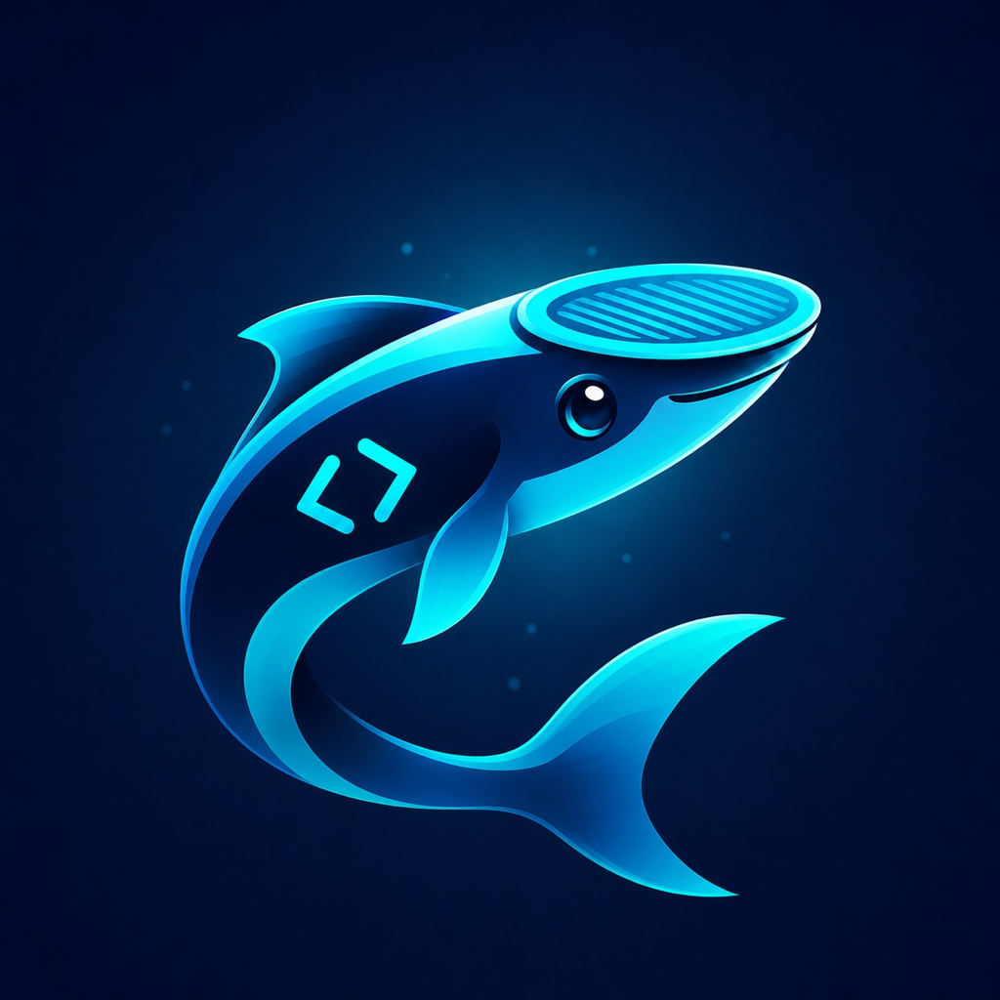

# Remora Link



Remora Link is the desktop host for the Remora mobile apps. It discovers,
launches, and multiplexes installed coding-agent harnesses over one
authenticated iroh/QUIC connection while keeping agent credentials on the
host.

Supported adapters include Codex, Pi, Amp, OpenCode, Claude Code, Factory
Droid, Hermes, Devin, Grok, ACP-compatible agents, and a restricted shell
bridge.

## Install

The production command is always `remora-link`.

| Channel | Command |
| --- | --- |
| npm | `npm install -g remora-link` |
| bun | `bunx remora-link` |
| source | `cargo install --locked --path crates/remora-link` |

The npm package installs the matching checksummed, SBOM-backed, and
GitHub-attested platform binary. Source builds produce the same command and
filesystem identity.

## Pair a device

```bash
remora-link
```

The first-run flow installs a per-user autostart service, starts the daemon,
and prints a short pairing code plus QR code for Codex access. To select
scopes and runtimes explicitly:

```bash
remora-link pair --qr --runtime codex
remora-link pair --qr --runtime codex --runtime claude --allow-restart
```

Interactive pairing is the default. The host and mobile app both show the
same authentication phrase and require confirmation before a durable
credential is issued. Invitations are single-use, expire quickly, and grant
only the selected runtime IDs and capabilities.

For unattended automation, the deliberately narrower mode requires an
explicit risk acknowledgement:

```bash
remora-link pair \
  --runtime codex \
  --unattended \
  --i-understand-first-claimer-wins
```

Unattended invitations authorize one runtime, cannot grant restart, and
expire within 60 seconds.

## Commands

| Command | Purpose |
| --- | --- |
| `remora-link serve` | Run the host in the foreground |
| `remora-link install` / `uninstall` | Manage per-user autostart |
| `remora-link status [--json]` | Show daemon, endpoint, and runtime status |
| `remora-link pair ...` | Create a scoped Remora Link v2 invitation |
| `remora-link pairing pending` | Review unconfirmed claims |
| `remora-link pairing confirm ...` | Confirm a claim after verifying the phrase |
| `remora-link devices list` | List paired devices |
| `remora-link devices revoke ...` | Revoke a device credential |
| `remora-link reload` | Reload runtime configuration |
| `remora-link agents list` | Show configured runtime availability |
| `remora-link logs [-f]` | Read host logs |
| `remora-link stop` | Gracefully stop the daemon |

Autostart is installed without administrator privileges:

- macOS: `~/Library/LaunchAgents/com.remora.link.plist`
- Linux: `~/.config/systemd/user/remora-link.service`, with an XDG desktop
  fallback
- Windows: a per-user `remora-link` Startup shortcut

## Transport and security

Remora Link accepts only the `remora-link/2` ALPN. Pairing uses ephemeral
invitations, bilateral confirmation, scoped durable device credentials,
proof-of-possession, replay protection, bounded frames and connection
quotas, explicit revocation, and credential epochs. No password, API token,
or coding-agent credential is sent to a paired client.

The v2 wire contract is documented in
[`docs/remora-link-v2-wire.md`](docs/remora-link-v2-wire.md). Older host
protocols and shared-token pairing are intentionally unsupported; upgrade
the host and re-pair.

## Configuration

`host.toml` is created on first run. It contains runtime and session policy,
not pairing secrets:

```toml
# relay = "https://example-relay.invalid"

[session]
replay_max_msgs = 2048
replay_max_bytes = 16777216
idle_ttl_secs = 600
pending_grace_secs = 60

[agents.codex]
enabled = true
bin = "codex"
transport = "auto"
host = "127.0.0.1"
port = 8390

[agents.claude]
enabled = true
bin = "claude"
bypass_permissions = false
```

Run `remora-link reload` after editing the file. Harness authentication
remains in each harness's own login store or in environment variables
explicitly supplied to the host service.

Codex `transport` accepts `auto`, `unix_proxy`, `unix_daemon`, `websocket`, or
`stdio`. Automatic selection uses Unix proxy when supported, then WebSocket,
then stdio. Select `websocket` to use the configured `host` and `port`;
Remora connects to an existing listener or starts one when none is listening.
Select `unix_daemon` only with Codex's managed standalone installation: npm
installations can advertise the daemon command without being able to run it.
Unix-proxy startup uses a private short socket path when `CODEX_HOME` would
exceed the OS pathname limit.
Restart Remora Link after changing the Codex binary or transport selection.

Optional detached wake publication has separate trusted-origin and private-token
configuration. See [Background Relay](docs/background-relay.md) for setup,
capability transfer, authenticated repair barriers, and verification limits.

## Development

```bash
cargo fmt --all -- --check
cargo clippy --workspace --all-targets --all-features -- -D warnings
BRIDGE_CONFORMANCE_SKIP_UPSTREAM_SCHEMA=1 cargo test --workspace --all-targets
node --test npm/test/*.test.mjs
```

The workspace contains a shared bridge core, one crate per harness adapter,
the Remora Link host library, the canonical CLI wrapper, conformance tests,
and platform-specific npm launchers. Release policy lives in
[`crates/remora-link/MAINTENANCE.md`](crates/remora-link/MAINTENANCE.md).

## License and provenance

Remora Link is licensed under GPL-3.0-only. See [`NOTICE.md`](NOTICE.md) for
the source lineage and attribution retained as a legal requirement.
